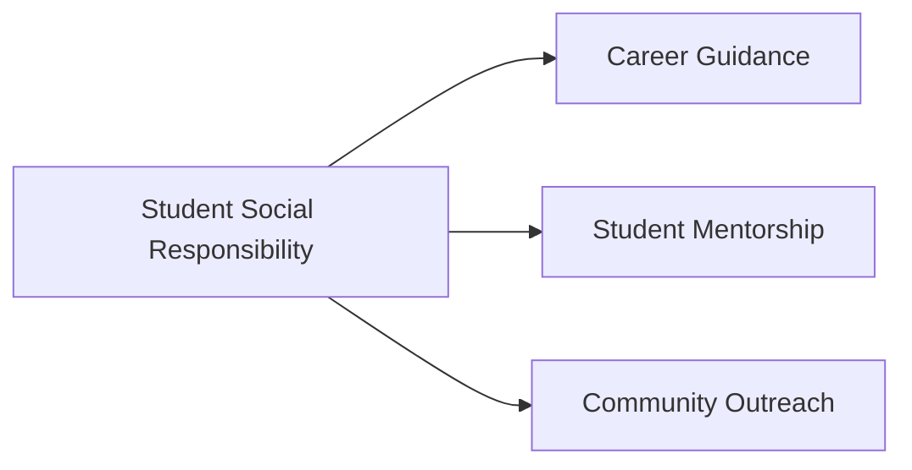

# Hi there, I'm Mounish Senisetty 👋

<div align="center">


<br/>

<p align="center">
  
  
  
  
</p>

</div>

---

## 🌌 About Me

<div align="center">
  
</div>

```yaml
name        : Mounish Senisetty
education   : B.Tech in Computer Science (AI & Data Science)
university  : Amrita Vishwa Vidyapeetham
cgpa        : 9.55 / 10.0
focus       : Software Engineering · AI/ML · Distributed Systems
research    : Federated Learning · Reinforcement Learning · Smart Grids
mission     : Build technology that creates measurable impact
```

<table>
<tr>
<td width="55%">

- 🎓 AI & Data Science Undergraduate
- 🤖 Exploring LLMs, RAG, and Agentic AI
- ⚙️ Strong in DSA, OS, DBMS, and System Design
- 📚 Published Researcher
- 🏆 Hackathon Winner and Finalist
- 🌍 Passionate about solving real-world problems

</td>
<td width="45%">


</td>
</tr>
</table>

---

## ⚡ Tech Universe

<div align="center">

### 💻 Languages & Core Technologies


### ⚙️ Backend & Infrastructure


### 🤖 AI / Machine Learning


<br/>


### 📊 Data Engineering & Visualization


</div>

---

## 🚀 Featured Projects

<div align="center">
  
</div>

<table>
<tr>
<td width="50%">

### 🤖 AI-Powered SQL Agent
**Python · LangChain · FastAPI · PostgreSQL**

- Natural language to SQL conversion
- Schema-aware query generation
- Query validation and safeguards

</td>
<td width="50%">

### 💼 Job Application Management System
**Node.js · Express.js · PostgreSQL**

- JWT Authentication
- Role-Based Access Control
- Optimized relational schema

</td>
</tr>

<tr>
<td width="50%">

### 📊 Web Log Analytics System
**Spark · Hadoop · MLlib**

- Distributed log processing
- Anomaly detection
- REST-based insights

</td>
<td width="50%">

### 🧪 Virtual Lab Development
**Biomedical Instrumentation**

- Real-time signal visualization
- Interactive simulations
- Remote accessibility

</td>
</tr>
</table>

---

## 📚 Research Publications

<div align="center">

| 📄 Publication | 🏛️ Venue | 🎯 Contribution |
|---------------|----------|----------------|
| RL-Guided Federated Learning for IIoT Microgrids | IEEE Transactions on Industrial Informatics | PPO-based dynamic client selection |
| Hybrid AI Framework for Smart Grid Energy Management | Journal of Computational and Applied Mathematics | LLM + LSTM + RL integration |

</div>

---

## 🏆 Achievements

<div align="center">


</div>

- 🥇 Amazon ML Challenge — Top 1.5% among 83,000+ participants
- 🥉 ACM EpochOn Hackathon — 3rd Prize Winner
- 🚀 Meta Scalar Open Environment Hackathon — National Finalist
- 🤖 OLABS National Hackathon — Finalist

---

## 📊 GitHub Analytics

<div align="center">


<br/>


</div>

---

## 📈 Contribution Activity

<div align="center">


</div>

---

## 🔬 Currently Exploring

```text
┌──────────────────────────────────────────────────────────────┐
│  Large Language Models (LLMs)      ████████████████  95%     │
│  Retrieval-Augmented Generation    ███████████████░  92%     │
│  Agentic AI Systems                ██████████████░░  88%     │
│  Reinforcement Learning            █████████████░░░  85%     │
│  Federated Learning                ████████████░░░░  82%     │
│  Distributed Systems               █████████████░░░  84%     │
└──────────────────────────────────────────────────────────────┘
```

---

## 🤝 Leadership & Community



---

## 🌐 Connect With Me

<div align="center">

[](mailto:senisettymounish@gmail.com)
[](https://linkedin.com/in/mounish-senisetty-257383286)
[](https://github.com/MounishSenisetty)
[](https://leetcode.com/u/Mounish_Mou/)

</div>

---

<div align="center">

### ✨ Philosophy

> **"The best way to understand technology is to build systems that solve real-world problems."**


</div>


