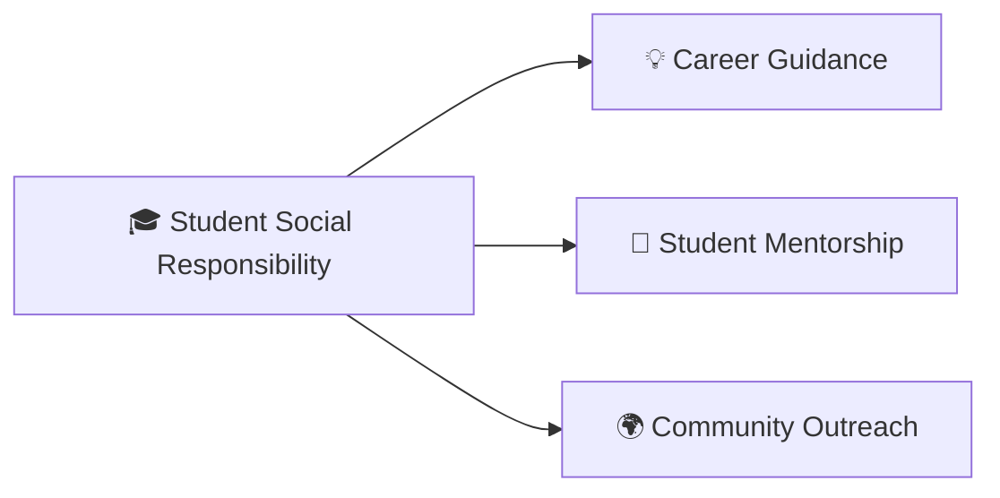

<div align="center">

<br/>


<br/><br/>


</div>

---

## 🌌 About Me

<div align="center">


</div>

```yaml
name        : Mounish Senisetty
education   : B.Tech in Computer Science (AI & Data Science)
university  : Amrita Vishwa Vidyapeetham
cgpa        : 9.52 / 10.0
focus       : Software Engineering · AI/ML · Distributed Systems
research    : Federated Learning · Reinforcement Learning · Smart Grids
mission     : Build technology that creates measurable impact
```

- 🎓 **AI & Data Science Undergraduate** at Amrita Vishwa Vidyapeetham
- 🤖 Exploring **LLMs, RAG, and Agentic AI**
- ⚙️ Strong foundation in **DSA, OS, DBMS, and System Design**
- 📚 **Published Researcher** in IEEE and computational journals
- 🏆 **Top 1.5%** in Amazon ML Challenge (83,000+ participants)
- 🚀 Multiple **Hackathon Winner & National Finalist**
- 🌍 Passionate about building solutions with real-world impact

---

## ⚡ Tech Universe

<div align="center">

### 💻 Languages


<br/>


### ⚙️ Backend & Infrastructure


### 🤖 AI / Machine Learning


<br/>


### 📊 Data Engineering & Visualization


</div>

---

## 🚀 Featured Projects

<table>
<tr>
<td width="50%" valign="top">

### 🤖 AI-Powered SQL Agent
**`Python` · `LangChain` · `FastAPI` · `PostgreSQL`**

- Natural language to SQL with schema-aware query generation
- Multi-step LLM orchestration using LangChain agents
- Query validation, safeguards, and explainability

</td>
<td width="50%" valign="top">

### 💼 Job Application Management System
**`Node.js` · `Express.js` · `PostgreSQL`**

- JWT Authentication with secure session management
- Role-Based Access Control (RBAC)
- Optimized relational schema for efficient querying

</td>
</tr>

<tr>
<td width="50%" valign="top">

### 📊 Web Log Analytics System
**`Apache Spark` · `Hadoop` · `MLlib`**

- Distributed log processing at scale
- Anomaly detection using clustering algorithms
- REST API exposing analytics insights

</td>
<td width="50%" valign="top">

### 🧪 Virtual Biomedical Lab
**`Biomedical Instrumentation` · `Web`**

- Real-time physiological signal visualization
- Interactive instrument simulations
- Remote learning accessibility

</td>
</tr>
</table>

---

## 📚 Research Publications

| 📄 Paper | 🏛️ Venue | 🎯 Key Contribution |
|--------|--------|--------|
| RL-Guided Federated Learning for IIoT Microgrids | IEEE Transactions on Industrial Informatics | PPO-based dynamic client selection |
| Hybrid AI Framework for Smart Grid Energy Management | Journal of Computational and Applied Mathematics | LLM + LSTM + RL integration |

---

## 🏆 Achievements

| 🏅 Award | 🎯 Details |
|--------|--------|
| 🥇 Amazon ML Challenge | Top 1.5% among 83,000+ participants |
| 🥉 ACM EpochOn Hackathon | 3rd Prize Winner |
| 🚀 Meta Scalar Open Environment Hackathon | National Finalist |
| 🤖 OLABS National Hackathon | National Finalist |

---

## 📊 GitHub Analytics

<div align="center">


<br/><br/>


<br/><br/>


</div>

---

## 🔬 Currently Exploring

```text
Large Language Models (LLMs)       ████████████████░  95%
Retrieval-Augmented Generation     ███████████████░░  92%
Agentic AI Systems                 ██████████████░░░  88%
Reinforcement Learning             █████████████░░░░  85%
Federated Learning                 ████████████░░░░░  82%
Distributed Systems                █████████████░░░░  84%
```

---

## 🤝 Leadership & Community



---

## 🌐 Connect With Me

<div align="center">

<a href="mailto:senisettymounish@gmail.com">
  
</a>

<a href="https://linkedin.com/in/mounish-senisetty-257383286">
  
</a>

<a href="https://github.com/MounishSenisetty">
  
</a>

<a href="https://leetcode.com/u/Mounish_Mou/">
  
</a>

</div>

---

<div align="center">

### ✨ Philosophy

> **"To understand is to observe without conclusions."**

<br/>


<br/>


</div>
